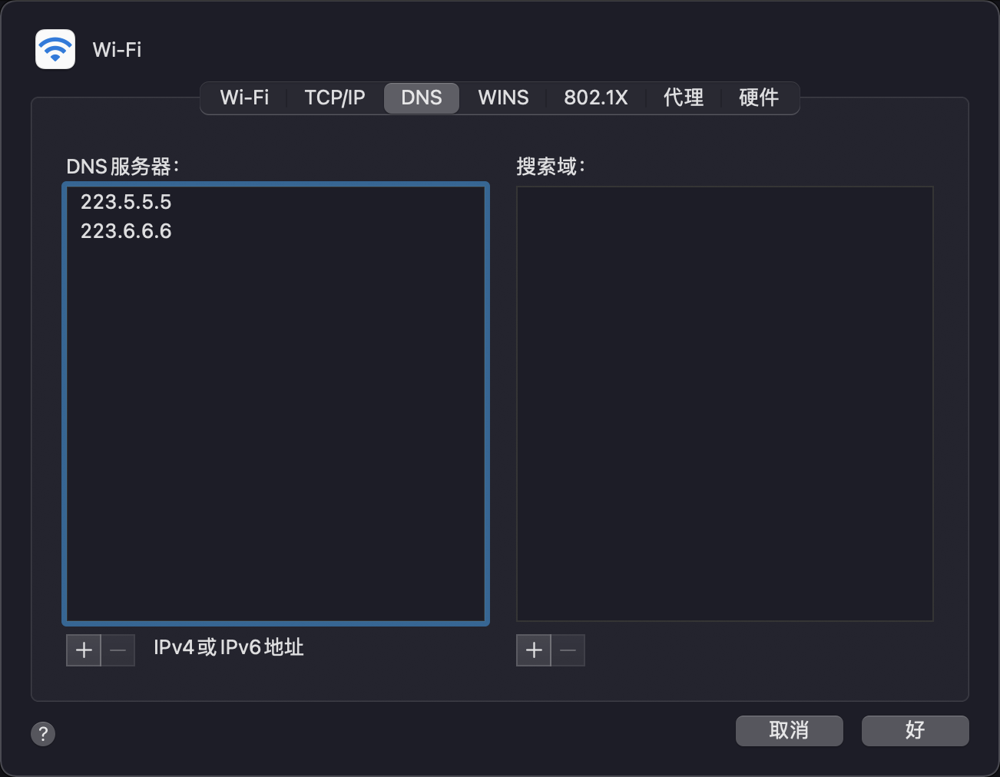

今天我使用GitHub的Page发现无妨访问，然后排查了下DNS解析服务器的问题。

爬了会百度发现大家都是用的百度的公共DNS，我试了下也没用，还是无法建立安全连接

<!--truncate-->

``` shell
shu-designdeMacBook-Pro:my-website design$ ping shulaotou.github.io
PING shulaotou.github.io (185.199.110.153): 56 data bytes
64 bytes from 185.199.110.153: icmp_seq=0 ttl=48 time=52.209 ms
64 bytes from 185.199.110.153: icmp_seq=1 ttl=48 time=48.894 ms
64 bytes from 185.199.110.153: icmp_seq=2 ttl=48 time=60.566 ms
64 bytes from 185.199.110.153: icmp_seq=3 ttl=48 time=51.585 ms
64 bytes from 185.199.110.153: icmp_seq=4 ttl=48 time=66.106 ms
``` 


:::tip

使用阿里DNS后

:::

```shell
shu-designdeMacBook-Pro:my-website design$ ping shulaotou.github.io
PING shulaotou.github.io (185.199.109.153): 56 data bytes
64 bytes from 185.199.109.153: icmp_seq=0 ttl=48 time=106.746 ms
64 bytes from 185.199.109.153: icmp_seq=1 ttl=48 time=114.118 ms
Request timeout for icmp_seq 2
64 bytes from 185.199.109.153: icmp_seq=3 ttl=46 time=299.122 ms
64 bytes from 185.199.109.153: icmp_seq=4 ttl=46 time=320.915 ms
64 bytes from 185.199.109.153: icmp_seq=5 ttl=46 time=340.595 ms
64 bytes from 185.199.109.153: icmp_seq=6 ttl=46 time=256.275 ms
```
